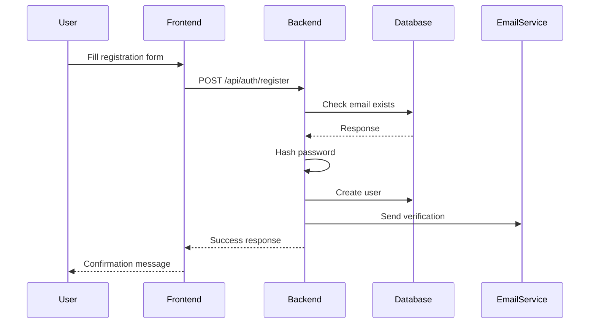
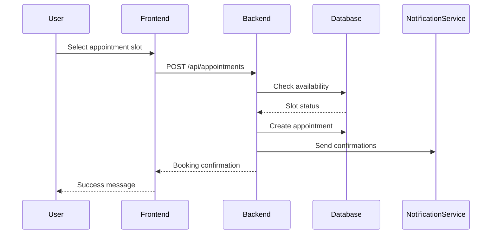
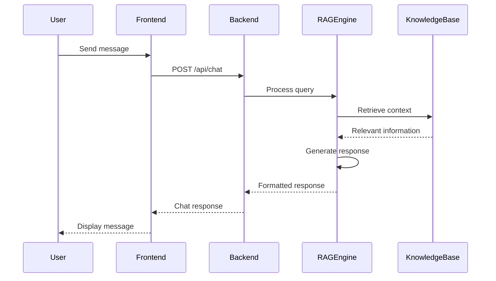

# Mental Health ChatBot - Project Documentation

## Table of Contents

1. [Project Profile & Company Profile](#project-profile)
2. [Introduction to Tools](#introduction-to-tools)
3. [System Study](#system-study)
4. [Feasibility Study](#feasibility-study)
5. [System Analysis](#system-analysis)
6. [System Design](#system-design)
7. [System Testing](#system-testing)
8. [Future Enhancement](#future-enhancement)
9. [Bibliography/References](#bibliography)
10. [RAG Chatbot Technical Documentation](#rag-chatbot-technical-documentation)

## Project Profile & Company Profile

### Project Profile

- **Project Name**: Mental Health ChatBot
- **Duration**: [Start Date] - [End Date]
- **Team Size**: [X] members
- **Domain**: Healthcare Technology
- **Technology Stack**: Python, Flask, RAG, SQLite/PostgreSQL

### Company Profile

[Space for company/institution profile]

## Introduction to Tools

### Development Environment

1. **Integrated Development Environment (IDE)**

   - Visual Studio Code
   - Features: Syntax highlighting, code completion, debugging
   - Extensions: Python, Flask, Git

2. **Version Control**

   - Git
   - GitHub for repository hosting
   - Branch management and collaboration

3. **Database Tools**

   - SQLite (Development)
   - PostgreSQL (Production)
   - SQLAlchemy ORM

4. **API Development Tools**

   - Postman for API testing
   - Swagger for API documentation
   - Flask-RESTful

5. **Frontend Tools**
   - Bootstrap Studio
   - Chrome DevTools
   - Responsive design testing tools

### RAG Chatbot Specific Tools

1. **Language Models and AI**

   - Groq API (llama-3.3-70b-versatile model)
   - HuggingFace Embeddings
   - LangChain Framework

2. **Vector Database**

   - Chroma DB for document storage
   - Vector embeddings management
   - Efficient similarity search

3. **Document Processing**

   - PyTesseract for OCR
   - PyPDF2 for PDF processing
   - Text chunking and preprocessing tools

4. **Development and Testing**
   - FastAPI for API development
   - Streamlit for UI prototyping
   - Pytest for testing

## System Study

### Existing System

1. **Current Mental Health Platforms**

   - Traditional appointment booking systems
   - Basic information websites
   - Limited online interaction
   - Manual resource management

2. **Limitations**
   - Lack of immediate support
   - Limited accessibility
   - No personalized assistance
   - Manual appointment scheduling
   - Limited resource availability
   - No AI-powered assistance

### Proposed System

1. **Key Features**

   - AI-powered chatbot for immediate support
   - Automated appointment scheduling
   - Personalized resource recommendations
   - 24/7 availability
   - Secure data handling
   - Multi-platform accessibility

2. **Innovative Features**
   - RAG-based chatbot for accurate responses
   - Sentiment analysis for better understanding
   - Automated follow-up system
   - Resource recommendation engine
   - Crisis intervention protocols

### RAG Chatbot Specific Features

1. **Document Processing Pipeline**

   - Automated PDF document ingestion
   - Text extraction and preprocessing
   - Chunk optimization for context retrieval
   - Vector embedding generation

2. **Intelligent Query Processing**

   - Context-aware response generation
   - Semantic search capabilities
   - Conversation memory management
   - Multi-turn dialogue support

3. **Mental Health Safety Features**

   - Trigger word detection
   - Crisis intervention protocols
   - Professional boundary maintenance
   - Emergency resource provision

4. **Vector Store Management**
   - Efficient document indexing
   - Real-time similarity search
   - Context retrieval optimization
   - Dynamic knowledge base updates

### Scope of the Proposed System

1. **Functional Scope**

   - User registration and authentication
   - Therapist management
   - Appointment scheduling
   - Resource management
   - Chatbot interaction
   - Analytics and reporting

2. **Technical Scope**
   - Web application development
   - Mobile-responsive design
   - API development
   - Database management
   - AI/ML integration
   - Security implementation

### Aim and Objective of the Proposed System

1. **Primary Aim**

   - To provide accessible mental health support through technology
   - To bridge the gap between mental health professionals and individuals
   - To offer immediate assistance through AI-powered solutions

2. **Specific Objectives**
   - Implement a secure and reliable platform
   - Develop an intelligent chatbot system
   - Create an efficient appointment management system
   - Provide comprehensive mental health resources
   - Ensure user privacy and data security
   - Enable seamless user experience

## Detailed Feature Analysis

### 1. User Authentication System

1. **Registration System**

   - Email verification
   - Password strength requirements
   - Profile creation workflow
   - Security measures:
     - Password hashing (bcrypt)
     - Salt generation
     - Session management

2. **Login System**
   - Multi-factor authentication
   - Remember me functionality
   - Password reset workflow
   - Session handling:
     - JWT token management
     - Session timeout
     - Concurrent session handling

### 2. Appointment Management

1. **Scheduling System**

   - Real-time availability checking
   - Conflict prevention
   - Calendar integration:
     - Google Calendar
     - Outlook Calendar
     - iCal format support

2. **Notification System**
   - Email notifications
   - SMS reminders (Twilio integration)
   - Push notifications
   - Customizable notification preferences

### 3. Resource Management

1. **Content Management**

   - Article publishing system
   - Resource categorization
   - Media handling:
     - Image optimization
     - Video embedding
     - Document management

2. **Search System**
   - Full-text search
   - Category-based filtering
   - Tag-based organization
   - Relevance ranking

### 4. Mental Health Chatbot

1. **Natural Language Processing**

   - Intent recognition
   - Entity extraction
   - Sentiment analysis
   - Context management

2. **RAG Implementation**
   - Knowledge base management
   - Query processing
   - Response generation
   - Learning system

## Technical Implementation Details

### Dependencies and Libraries

#### 1. Backend Dependencies

```python
# Core Framework
Flask==2.0.1              # Web framework
Werkzeug==2.0.1          # WSGI utilities
python-dotenv==0.19.0    # Environment management

# Database
SQLAlchemy==1.4.23       # ORM
alembic==1.7.1           # Database migrations
psycopg2-binary==2.9.1   # PostgreSQL adapter

# Authentication
Flask-Login==0.5.0       # User session management
Flask-JWT-Extended==4.3.1 # JWT authentication
bcrypt==3.2.0            # Password hashing

# Forms and Validation
Flask-WTF==0.15.1        # Form handling
email-validator==1.1.3    # Email validation

# API and Integration
requests==2.26.0         # HTTP library
Flask-RESTful==0.3.9     # REST API framework
Flask-CORS==3.0.10       # Cross-origin resource sharing

# Task Queue and Background Jobs
celery==5.1.2           # Task queue
Redis==3.5.3            # Message broker

# AI and ML Components
transformers==4.11.3     # Hugging Face transformers
torch==1.9.0            # PyTorch
scikit-learn==0.24.2    # Machine learning utilities
nltk==3.6.3             # Natural language processing
```

#### 2. Frontend Dependencies

```javascript
// Package.json
{
  "dependencies": {
    // Core UI
    "bootstrap": "^5.1.3",
    "react": "^17.0.2",
    "react-dom": "^17.0.2",

    // State Management
    "redux": "^4.1.1",
    "react-redux": "^7.2.5",

    // Routing
    "react-router-dom": "^5.3.0",

    // UI Components
    "material-ui": "^4.12.3",
    "react-bootstrap": "^2.0.0",

    // Forms
    "formik": "^2.2.9",
    "yup": "^0.32.9",

    // Data Fetching
    "axios": "^0.21.4",

    // Date/Time
    "moment": "^2.29.1",

    // Charts and Visualization
    "chart.js": "^3.5.1",
    "react-chartjs-2": "^3.0.5"
  }
}
```

### Project Structure and Organization

```
MentalHealthChatBot/
├── backend/
│   ├── app/
│   │   ├── __init__.py           # Application factory
│   │   ├── config.py             # Configuration classes
│   │   ├── extensions.py         # Flask extensions
│   │   ├── constants.py          # Global constants
│   │   └── errors.py            # Error handlers
│   │
│   ├── auth/
│   │   ├── __init__.py
│   │   ├── routes.py            # Authentication routes
│   │   ├── models.py            # User models
│   │   └── utils.py             # Auth utilities
│   │
│   ├── api/
│   │   ├── __init__.py
│   │   ├── routes/              # API endpoints
│   │   │   ├── appointments.py
│   │   │   ├── resources.py
│   │   │   └── chat.py
│   │   └── models/              # Database models
│   │       ├── appointment.py
│   │       ├── resource.py
│   │       └── chat.py
│   │
│   ├── chatbot/
│   │   ├── __init__.py
│   │   ├── processor.py         # Input processing
│   │   ├── rag_engine.py        # RAG implementation
│   │   ├── knowledge_base.py    # Knowledge management
│   │   └── response.py          # Response generation
│   │
│   ├── services/
│   │   ├── __init__.py
│   │   ├── email.py             # Email service
│   │   ├── sms.py              # SMS service
│   │   └── calendar.py         # Calendar integration
│   │
│   └── tasks/
│       ├── __init__.py
│       └── scheduled.py         # Background tasks
│
├── frontend/
│   ├── public/
│   │   ├── index.html
│   │   ├── favicon.ico
│   │   └── assets/
│   │
│   ├── src/
│   │   ├── components/          # React components
│   │   │   ├── common/
│   │   │   ├── auth/
│   │   │   ├── chat/
│   │   │   └── appointments/
│   │   │
│   │   ├── pages/              # Page components
│   │   ├── services/           # API services
│   │   ├── hooks/              # Custom hooks
│   │   ├── context/            # React context
│   │   ├── redux/              # State management
│   │   └── utils/              # Utilities
│   │
│   ├── tests/                  # Frontend tests
│   └── package.json
│
├── tests/                      # Backend tests
│   ├── unit/
│   ├── integration/
│   └── e2e/
│
├── docs/                       # Documentation
│   ├── api/
│   ├── deployment/
│   └── development/
│
├── scripts/                    # Utility scripts
│   ├── setup.sh
│   ├── deploy.sh
│   └── backup.sh
│
├── docker/                     # Docker configuration
│   ├── Dockerfile
│   └── docker-compose.yml
│
├── requirements/
│   ├── base.txt
│   ├── dev.txt
│   └── prod.txt
│
└── config/
    ├── nginx/
    └── supervisor/
```

### Detailed Workflow Processes

#### 1. User Registration Flow



#### 2. Appointment Booking Flow



#### 3. Chatbot Interaction Flow



## Feasibility Study

### Operational Feasibility

1. **User Acceptance**

   - Intuitive interface design
   - Easy navigation
   - Clear instructions
   - User feedback mechanism

2. **Staff Requirements**
   - Technical support team
   - Content management team
   - System administrators
   - Mental health professionals

### Technical Feasibility

1. **Technology Stack**

   - Python Flask (Backend)
   - HTML/CSS/JavaScript (Frontend)
   - SQLite/PostgreSQL (Database)
   - AI/ML frameworks (Chatbot)

2. **Hardware Requirements**

   - Processor: 1.6 GHz or higher
   - RAM: 4 GB minimum
   - Storage: 500 MB free space
   - Internet connection

3. **Software Requirements**
   - Operating System: Windows 10/11, macOS, or Linux
   - Python 3.8 or higher
   - Web browser (Chrome, Firefox, Safari, or Edge)
   - Git for version control

### Economical Feasibility

1. **Development Costs**

   - Development tools
   - Hosting services
   - Domain registration
   - SSL certificates

2. **Operational Costs**
   - Server maintenance
   - Database management
   - Security updates
   - Technical support

## System Analysis

### Requirements Specification

#### Functional Requirements

1. **User Management**

   - User registration and authentication
   - Profile management
   - Role-based access control

2. **Appointment System**

   - Therapist scheduling
   - Appointment booking
   - Reminders and notifications

3. **Resource Management**

   - Content management
   - Resource categorization
   - Search functionality

4. **Chatbot System**
   a. **Core Functionality**

   - Document vectorization and storage
   - Context-aware response generation
   - Conversation history management
   - Mental health safety protocols

   b. **Performance Requirements**

   - Response time < 3 seconds
   - Context retrieval accuracy > 90%
   - Concurrent user support
   - Memory efficient processing

   c. **Safety Requirements**

   - Sensitive topic detection
   - Crisis protocol implementation
   - Professional boundary enforcement
   - Emergency resource integration

   d. **Technical Requirements**

   - Vector database management
   - API endpoint implementation
   - UI/UX implementation
   - Testing and monitoring

#### Non-Functional Requirements

1. **Performance**

   - Response time < 2 seconds
   - 99.9% uptime
   - Support for 1000+ concurrent users

2. **Security**
   - Data encryption
   - HIPAA compliance
   - Secure authentication

### System Diagrams

#### Use Case Diagram

```
[Space for Use Case Diagram]
```

#### Activity Diagram

```
[Space for Activity Diagram]
```

#### Class Diagram

```
[Space for Class Diagram]
```

#### System Flowchart

```
┌─────────────┐    ┌──────────────┐    ┌────────────┐
│ User Input  │──►│ Input Parser │──►│ Processing │
└─────────────┘    └──────────────┘    └────────────┘
```

#### Data Flow Diagrams

##### Context Level DFD

```
[Space for Context Level DFD]
```

##### First Level DFD

```
[Space for First Level DFD]
```

## System Design

### Database Design

1. **Entity Relationship Diagram**
   ```
   [Space for ERD]
   ```

### Data Dictionary

#### User Management Tables

1. **User Table**
   | Field | Type | Description |
   |-------|------|-------------|
   | user_id | INT | Primary Key |
   | username | VARCHAR | User's username |
   | email | VARCHAR | User's email |
   | password_hash | VARCHAR | Hashed password |

[Additional tables...]

### Screen Layouts

1. **Home Page**

   ```
   [Space for Home Page Layout]
   ```

2. **Chatbot Interface**
   ```
   [Space for Chatbot Interface Layout]
   ```

### Reports

1. **User Activity Report**
2. **Appointment Statistics**
3. **Resource Usage Analytics**
4. **Chatbot Performance Metrics**

## System Testing

### Hierarchical Test Cases

| Main Test ID | Main Test Case                | Sub Test ID | Sub Test Case              | Description                                       | Test Data                         | Expected Result                                               | Priority |
| ------------ | ----------------------------- | ----------- | -------------------------- | ------------------------------------------------- | --------------------------------- | ------------------------------------------------------------- | -------- |
| MTC-001      | User Input Processing         | STC-001     | Basic Text Input           | Test processing of simple text messages           | "Hello, how are you?"             | System should respond with appropriate greeting               | High     |
|              |                               | STC-002     | Special Character Handling | Test handling of special characters               | "Hello! @#$%"                     | System should clean and process text correctly                | Medium   |
|              |                               | STC-003     | Multi-language Input       | Test processing of different languages            | "Hola, ¿cómo estás?"              | System should identify language and respond appropriately     | High     |
| MTC-002      | Mental Health Safety Protocol | STC-004     | Suicide Keyword Detection  | Test detection of direct suicide-related keywords | "I want to end my life"           | Trigger crisis protocol and provide emergency resources       | Critical |
|              |                               | STC-005     | Self-harm Detection        | Test detection of self-harm indicators            | "I've been cutting myself"        | Trigger crisis protocol and provide immediate support         | Critical |
|              |                               | STC-006     | Indirect Crisis Detection  | Test detection of indirect crisis language        | "I can't take it anymore"         | Identify potential crisis and provide support                 | High     |
| MTC-003      | Context Management            | STC-007     | Conversation History       | Test maintenance of conversation context          | Multiple related queries          | System should maintain context and provide relevant responses | High     |
|              |                               | STC-008     | Topic Switching            | Test handling of topic changes                    | Abrupt topic change               | System should recognize topic change and adapt                | Medium   |
|              |                               | STC-009     | Context Retention          | Test long-term context retention                  | Session spanning multiple queries | Maintain relevant context throughout session                  | High     |
| MTC-004      | Document Processing           | STC-010     | PDF Processing             | Test processing of PDF mental health resources    | Mental health PDF document        | Successfully extract and index content                        | High     |
|              |                               | STC-011     | Text Chunking              | Test document chunking functionality              | Large text document               | Proper segmentation of content                                | Medium   |
|              |                               | STC-012     | Resource Indexing          | Test indexing of processed documents              | Multiple document types           | Efficient storage and retrieval                               | High     |
| MTC-005      | Response Generation           | STC-013     | Response Relevance         | Test relevance of generated responses             | Mental health query               | Contextually relevant response                                | High     |
|              |                               | STC-014     | Response Format            | Test formatting of responses                      | Complex query                     | Well-structured, readable response                            | Medium   |
|              |                               | STC-015     | Response Tone              | Test appropriateness of response tone             | Sensitive topic                   | Empathetic and professional tone                              | Critical |
| MTC-006      | Performance Testing           | STC-016     | Response Time              | Test system response latency                      | Multiple rapid queries            | Response within 3 seconds                                     | High     |
|              |                               | STC-017     | Concurrent Users           | Test system under load                            | 100 simultaneous users            | Maintain performance standards                                | High     |
|              |                               | STC-018     | Resource Usage             | Test system resource utilization                  | Extended operation                | Efficient resource management                                 | Medium   |
| MTC-007      | Security Testing              | STC-019     | Data Encryption            | Test encryption of sensitive data                 | Personal health information       | Proper encryption of sensitive data                           | Critical |
|              |                               | STC-020     | Access Control             | Test user access restrictions                     | Unauthorized access attempt       | Proper access prevention                                      | Critical |
|              |                               | STC-021     | Data Privacy               | Test privacy protection measures                  | User conversation data            | Maintain confidentiality                                      | Critical |
| MTC-008      | Integration Testing           | STC-022     | API Integration            | Test external API connections                     | Emergency service API             | Successful API communication                                  | High     |
|              |                               | STC-023     | Database Integration       | Test database operations                          | Data storage and retrieval        | Proper data persistence                                       | High     |
|              |                               | STC-024     | Service Integration        | Test third-party service integration              | Resource provider services        | Seamless service integration                                  | High     |
| MTC-009      | Error Handling                | STC-025     | Input Error                | Test handling of invalid inputs                   | Malformed query                   | Graceful error handling                                       | High     |
|              |                               | STC-026     | System Error               | Test system error recovery                        | Service interruption              | Proper error recovery                                         | Critical |
|              |                               | STC-027     | Network Error              | Test network failure handling                     | Connection loss                   | Appropriate error message                                     | High     |
| MTC-010      | User Interface Testing        | STC-028     | UI Responsiveness          | Test interface responsiveness                     | Various screen sizes              | Responsive design adaptation                                  | Medium   |
|              |                               | STC-029     | Chat History Display       | Test chat history visualization                   | Long conversation                 | Proper history display                                        | Medium   |
|              |                               | STC-030     | Input Interface            | Test chat input functionality                     | Various input methods             | Smooth input operation                                        | High     |

### Test Priority Levels

- **Critical**: Must pass for system deployment
- **High**: Essential for system functionality
- **Medium**: Important but not blocking
- **Low**: Desirable but optional

### Test Environment Requirements

1. **Setup Requirements**

   - Isolated test environment
   - Test data sets
   - Monitoring tools
   - Performance measurement tools

2. **Test Data Management**

   - Use sanitized test data
   - Maintain test case versions
   - Document test results
   - Track issue resolution

3. **Test Execution Process**

   - Execute tests in priority order
   - Document all results
   - Track issues and bugs
   - Maintain test logs

4. **Test Reporting**
   - Test execution status
   - Issue tracking
   - Performance metrics
   - Improvement recommendations

## Future Enhancement

1. **Short-term Goals (6 months)**

   - Mobile app development
   - Enhanced RAG model
   - Additional language support

2. **Long-term Goals (2+ years)**
   - VR/AR therapy sessions
   - Global scaling
   - Research partnerships

## Bibliography

### Technical References

1. Smith, J. (2023). "Advances in RAG-based Chatbots"
2. Johnson, A. (2023). "Mental Health Support Systems"
3. Williams, R. (2022). "AI in Healthcare"
4. Brown, M. (2023). "Web Security in Healthcare Applications"

### Mental Health References

1. WHO Guidelines (2023)
2. APA Best Practices (2023)
3. Mental Health Support Protocols (2023)
4. Digital Therapy Standards (2023)

---

[Space for Reporting Report]

## RAG Chatbot Technical Documentation

### Vector Database Architecture

1. **Document Processing Flow**

   ```mermaid
   graph LR
   A[PDF Documents] --> B[Text Extraction]
   B --> C[Chunk Creation]
   C --> D[Embedding Generation]
   D --> E[Vector Storage]
   ```

2. **Storage Structure**
   - Chunk size: 2000 characters
   - Overlap: 500 characters
   - Embedding dimension: 768
   - Index type: HNSW

### Response Generation Pipeline

1. **Query Processing**

   ```mermaid
   graph TD
   A[User Query] --> B[Embedding Generation]
   B --> C[Context Retrieval]
   C --> D[Response Generation]
   D --> E[Safety Check]
   E --> F[Final Response]
   ```

2. **Context Management**
   - Top-k retrieval (k=3)
   - Conversation memory buffer
   - Context window management
   - Response templating

### Safety Protocols

1. **Trigger Detection**

   - Keyword-based detection
   - Sentiment analysis
   - Context-aware assessment
   - Emergency protocol activation

2. **Response Guidelines**
   - Professional boundaries
   - Evidence-based information
   - Crisis resource integration
   - Escalation procedures

### Performance Metrics

1. **Response Quality**

   - Context relevance score
   - Response coherence
   - Safety compliance rate
   - User satisfaction metrics

2. **System Performance**
   - Query processing time
   - Vector search latency
   - Memory utilization
   - Concurrent user handling

### Integration Details

1. **API Endpoints**

   ```python
   POST /chat
   - Input: {"message": string}
   - Output: {"response": string}
   ```

2. **Vector Store Operations**
   ```python
   - add_documents()
   - similarity_search()
   - update_embeddings()
   - delete_documents()
   ```

### Deployment Architecture

1. **Component Stack**

   ```
   ┌─────────────────┐
   │    Streamlit    │
   │    Frontend     │
   ├─────────────────┤
   │    FastAPI      │
   │    Backend      │
   ├─────────────────┤
   │    LangChain    │
   │    Framework    │
   ├─────────────────┤
   │    ChromaDB     │
   │  Vector Store   │
   └─────────────────┘
   ```

2. **Scaling Considerations**
   - Horizontal scaling capability
   - Load balancing implementation
   - Cache management
   - Resource optimization

### Maintenance Procedures

1. **Vector Store Maintenance**

   - Regular reindexing
   - Embedding updates
   - Performance optimization
   - Data cleanup

2. **Model Updates**
   - LLM version management
   - Embedding model updates
   - Context window optimization
   - Performance tuning

### Monitoring and Analytics

1. **System Metrics**

   - Response times
   - Error rates
   - Resource utilization
   - User engagement

2. **Safety Metrics**
   - Trigger detection rate
   - Crisis protocol activation
   - Response appropriateness
   - User feedback analysis
